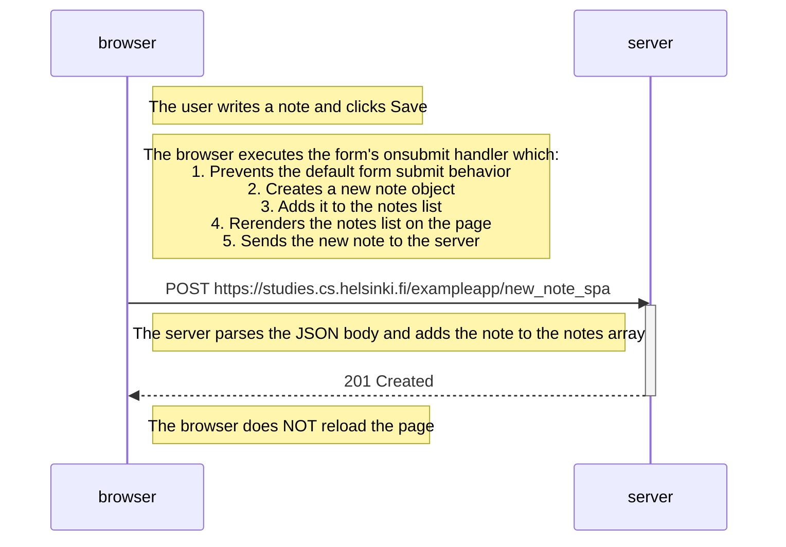

# 0.6: New Note in Single Page App Diagram

The following diagram depicts the situation where the user creates a new note using the single-page version of the app at https://studies.cs.helsinki.fi/exampleapp/spa.

